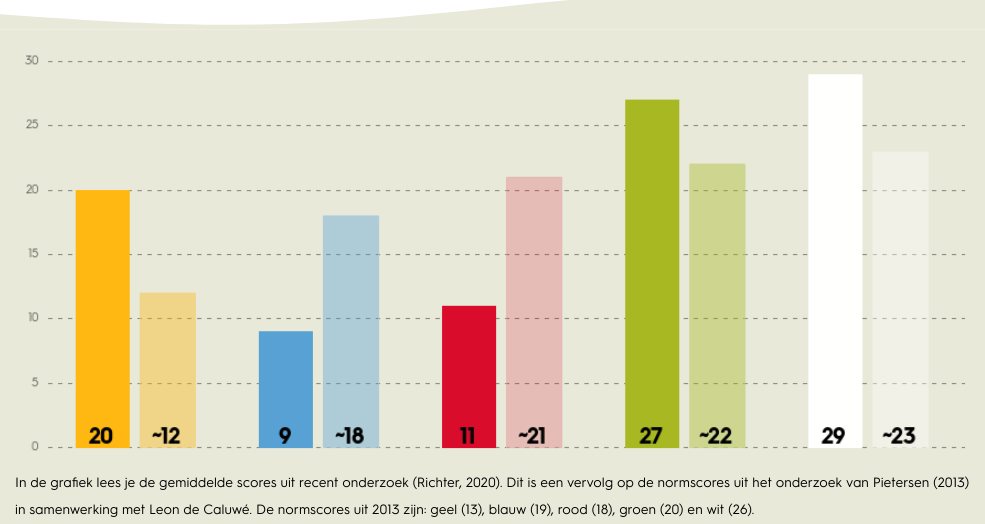

## Wat is de kleurentest van Caluwe?

De kleurentest van Caluwé onderscheidt vijf stijlen van verandering, weergegeven in kleuren. Geel draait om macht en belangen, blauw om structuur en controle, rood focust op motivatie en mensen, groen op leren en samenwerken, en wit op zelforganisatie en natuurlijke processen. Het model helpt inzicht te krijgen in hoe mensen en teams omgaan met veranderingen en hoe verschillende stijlen elkaar kunnen aanvullen.
  
## Wat zijn mijn test resultaten?

| **Kleur**        | **Score** | **Beschrijving**                                                |
|-------------------|-----------|----------------------------------------------------------------|
| **Geel**         | 20        | Verandering via belangen, draagvlak en win-win oplossingen.   |
| **Blauw**        | 9         | Gericht op plannen, structuur en rationele doelen.            |
| **Rood**         | 11        | Focus op motivatie, verbinding en de fit tussen mens en werk. |
| **Groen**        | 27        | Verandering door leren, experimenteren en ontwikkeling.       |
| **Wit**          | 29        | Vertrouwen in natuurlijke verandering en zelforganisatie.     |

## Reflectie

Op basis van mijn resultaten zie ik dat mijn sterkste kleuren wit en groen zijn, met respectievelijk 29 en 27 punten. Dit betekent dat ik een veranderaar ben die vooral gelooft in natuurlijke verandering en leren. Ik zie verandering als iets dat spontaan en organisch kan ontstaan, en mijn rol is vooral het wegnemen van blokkades en het stimuleren van wat er al speelt. Tegelijkertijd hecht ik veel waarde aan het ontwikkelen van mensen en organisaties door leren en experimenteren centraal te stellen. Mijn lagere scores op geel, rood en blauw laten zien dat ik minder gericht ben op macht, structuur of motivatie als drijvende krachten achter verandering, maar meer vertrouw op de kracht van zelforganisatie en groei.

## Eerste dag bij mijn afstudeerstage

Mijn doel is om een plek te vinden waar ik zoveel mogelijk kan leren en doen, waar ik mijn grenzen kan verleggen. Ik wil een moeilijke opdracht aanpakken, een die me uitdaagt en me laat innoveren, het onbekende en het mysterie trekken me aan. Voorbereiding vind ik niet zo belangrijk; ik duik er gewoon in en kijk wat er gebeurt. Op mijn eerste dag loop ik naar binnen zonder precies te weten wat me te wachten staat. Ik word gemaild over een complexe opdracht, en eerlijk gezegd, ik geniet ervan. Regels zijn niets voor mij; ik houd ervan om meteen in actie te komen en dingen te laten gebeuren. Bam, boom, aan de slag!

