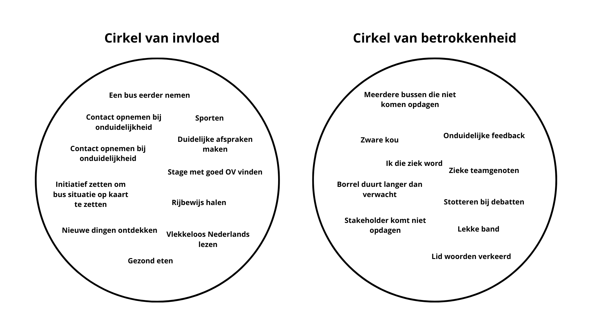

## Cirkel van Betrokkenheid & Invloed

De **Cirkel van Betrokkenheid en Invloed** is een model ontwikkeld door Stephen Covey. Het helpt je om te focussen op zaken waar je echt invloed op hebt, in plaats van je energie te verspillen aan dingen waar je geen controle over hebt.

1. **Cirkel van Betrokkenheid**: Alles waar je aandacht aan besteedt of je zorgen over maakt, zoals het weer, wereldproblemen of meningen van anderen.
2. **Cirkel van Invloed**: Dit is de kleinere cirkel binnen de Cirkel van Betrokkenheid, waar je direct invloed op kunt uitoefenen, zoals je gedrag, keuzes en acties.

De boodschap is simpel: besteed meer tijd aan je Cirkel van Invloed. Dit maakt je niet alleen effectiever, maar geeft ook een gevoel van controle en rust.

## Hoe ziet mijn cirkel eruit?

## Reflectie

In principe ben ik een fan van het stoicijnse gedachtegoed. Mijn kennismaking ermee kwam via het boek *"The Obstacle Is the Way"* van Ryan Holiday. Het voelt bevrijdend om moeilijke "wat als"-vragen los te laten en je te richten op wat je kunt doen.

De Cirkel van Betrokkenheid was voor mij eerlijk gezegd soms ook een excuus om even te klagen. Natuurlijk kan dat opluchten, maar uiteindelijk wil je problemen oplossen. Neem bijvoorbeeld de bus die te laat is of helemaal niet komt opdagen. Ik kan lang klagen over Qbuzz, maar ik kan ook actie ondernemen door contact te zoeken met de gemeenteraad. Zij kunnen meer betekenen dan ik alleen, en dat neemt een last van mijn schouders.

Daarnaast ben ik nu bezig met mijn rijbewijs. Hoewel ik liever met het OV reis, is een auto soms gewoon handiger. Het voelt geweldig om actie te ondernemen en daarmee hoop te creeren, in plaats van passief af te wachten. Het schrijven van deze blog is daar ook een voorbeeld van. Mijn schrijfvaardigheid is niet altijd perfect, maar dankzij tools zoals ChatGPT kan ik mijn teksten verbeteren en leren van mijn fouten.

